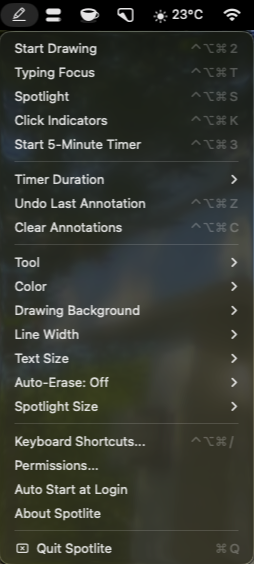
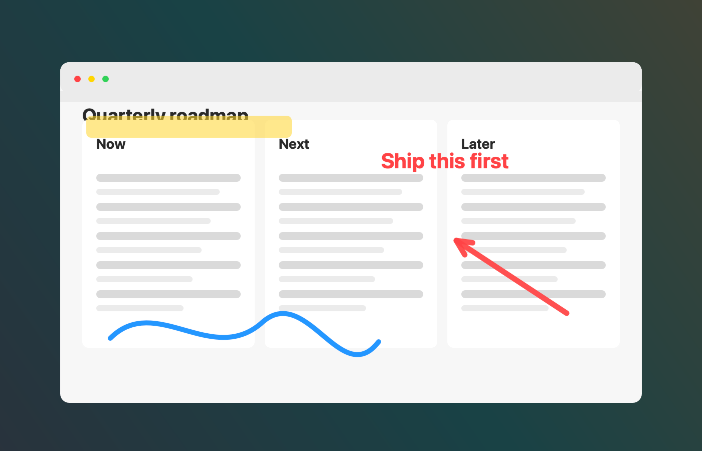
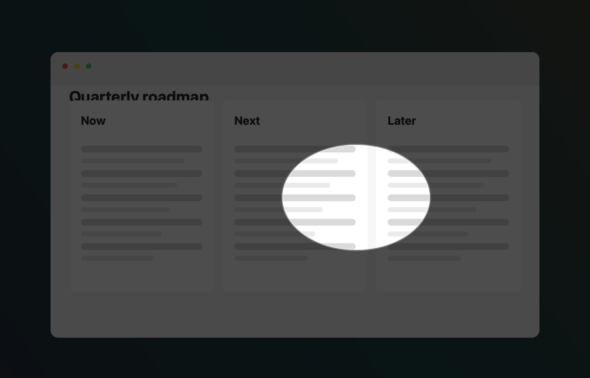
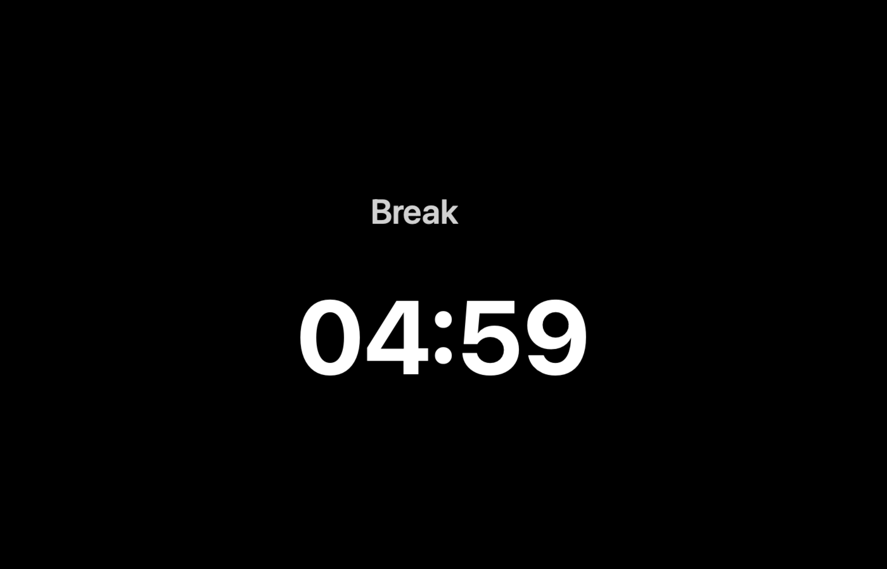

# Spotlite

Spotlite is an open-source macOS presenter tool. It lives in the menu bar and helps presenters draw attention to what matters on screen while teaching, demoing, recording, or screen sharing.

## Install

```sh
brew tap maartengoet/tap
brew install --cask spotlite
```

## Features

- Screen drawing with pen, highlighter, text, lines, arrows, rectangles, and ovals
- Color, stroke width, text size, whiteboard, blackboard, and auto-erase controls
- Spotlight and Typing Focus attention modes
- Click indicators for live demos and recordings
- Full-screen break timer with configurable duration
- Keyboard shortcuts, permissions guidance, and auto-start at login

## Screenshots

| Menu bar | Drawing tools |
| --- | --- |
|  |  |

| Spotlight | Break |
| --- | --- |
|  |  |

## License

Spotlite is released under the MIT License.
